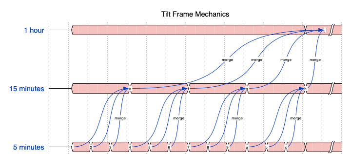

# Aggregations

A key feature of the [Select] queries are aggregations. These are supported with:

- Windows - A window is a range of events, clock or data time. There can be many different types of windows.
- Aggregate functions - An aggregate function is a function that runs in the context of a window of events, emitting results intermittently
- Tilt Frames - A tilt frame is a chain of compatible windows with **decreasing** resolution used to reduce memory pressure and preserve relative accuracy of windowed aggregate functions

An example clock-driven tumbling window:

```troy
use std::time::nanos;

define window `15secs` from tumbling
with
   interval = nanos::from_seconds(15),
end;

select {
    "count": aggr::stats::count(), # Aggregate 'count' function
    "min": aggr::stats::min(event.value),
    "max": aggr::stats::max(event.value),
    "mean": aggr::stats::mean(event.value),
    "stdev": aggr::stats::stdev(event.value),
    "var": aggr::stats::var(event.value),
}
from in[`15secs`] # We apply the window nominally to streams or input ports
into out;
```

To use a window we need to define the window specifications, such as a 15 second clock-based
tumbling window called `15secs` as above. We can then create instances of these windows at runtime by
applying those windows to streams. This is done in the `from` clause of a `select` statement.

Wherever windows are applied, aggregate functions can be used. In the above example, we are calculating
the minimum, maximum, average, standard deviation and variance of a `value` numeric field in data streaming
into the query via the standard input stream.

The query language is not constrained to clock-driven window definitions. Windows can also be
data-driven or fully programmatic.

A more complete example:

```tremor
select {
    "measurement": event.measurement,
    "tags": patch event.tags of insert "window" => window end,
    "stats": aggr::stats::hdr(event.fields[group[2]], [ "0.5", "0.9", "0.99", "0.999" ]),
    "class": group[2],
    "timestamp": aggr::win::first(event.timestamp),
}
from in[`10secs`, `1min`, `10min`, `1h`]
where event.measurement == "udp_lb_test"
   or event.measurement == "kafka-proxy.endpoints"
   or event.measurement == "burrow_group"
   or event.measurement == "burrow_partition"
   or event.measurement == "burrow_topic"
group by set(event.measurement, event.tags, each(record::keys(event.fields)))
into normalize;
```

In the above example we use a single aggregate function called `aggr::stats::hdr` which uses a high dynamic range
or HDR Histogram to compute quantile estimates and basic statistics against a number of dynamic grouping fields
set by the `group` clause. A group clause effectively partitions our operation by the group expressions provided
by the trickle query programmer. In the example, we're using the field names of the nested 'fields' record on inbound
events to compose a component of a group that is also qualified by tags and a measurement name. The field component
is used as a numeric input to the histogram aggregate function.

In the `from` clause, we are using a tilt frame, or a succession of window resolutions over which this aggregate
function is producing results. So a `10secs` window is emitting on a 10-second repeating basis into a `1min` frame.
So 6 times per second the state of the 10 second window is merged into the `1min` frame. This merge process is
performed for each frame in the tilt frame.

The advantage of tilt-frames is that as the target expression is **the same** for each frame, we can _merge_ across
each frame without amplifying error - in short, we get the **effect** of summarisation without loss of accuracy.

## Windowing

Assuming a periodic event delivered every 2 seconds into tremor.


A size based window of size 2 would emit a synthetic output event every 2 events.
So the lifespan of a size based window is 2 events, repeated and non-overlapping for tumbling style windows.
In the illustration above events `1` and `2` in the first window `w0` produce a single synthetic or derivate event `a`
Events `3` and `4` in the second window `w1` produce a single synthetic or derivate event `b`
As there is no 6th event in the example illustration, we will _never_ get another synthetic output event

Contrast this with the 10 second or clock-based tumbling window. In the first window `w0`s lifetime we capture
all events in the illustration.

## Tilt Frames

Assuming a continuous flow of events into tremor...



All the synthetic outputs of successive 5 minute windows that fit into a 15 minute interval are **merged**
into the 15 minute window. All the outputs of successive 15 minute intervals that fit into a 1 hour interval
are **merged** into the 1 hour window. By chaining and merging, tremor can optimise ( reduce ) the amount
of memory required across the chain when compared to multiple independent windows `select` expressions.
In the case of aggregate functions like ` aggr::stats::hdr`` or `aggr::stats::dds``` the savings are significant.

If we imagine 1M events per second, that is 300M events every 5 minutes. 900M every 15, 3.6B every hour.

By using tilt frames we can maximally minimize internal memory consumption, whilst reducing the volume of
incremental computation ( per event, per frame ), and further whilst preserving relative accuracy for
merge-capable aggregate functions.

The converged statistics under merge exhibit the same relative accuracy at a fraction of the computational
and memory overhead without the using the tilt-frame mechanism.

[Select]: ../language/pipelines.md#select-queries